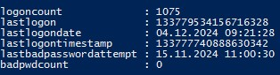

# AD-HoneyUser-Logon-Simulator
PowerShell script designed to simulate logon activity for Active Directory honeypot user accounts

AD-HoneyUser-Logon-Simulator is a PowerShell script that simulates logon activity for honeypot user accounts in an Active Directory environment. It modifies specific attributes like `logonCount`, ``lastLogon``, ``lastLogonDate``, ``lastLogonTimestamp``, ``lastBadPasswordAttempt``, and ``badPwdCount`` to make honeypot accounts appear more realistic and active.

## Warning
Please note that honeypot users do not need the permission to successfully execute the Invoke-Command for attributes like lastLogon or lastBadPasswordAttempt to be updated. These attributes are modified as soon as the Kerberos ticket-granting process (krbtgt) occurs, even if the subsequent command execution fails.

## Features
- Simulates both successful and failed logon attempts for honeypot accounts via kerberos authentication.
- Randomizes logon intervals to mimic real-world user behavior.
- Logs activity to a file for tracking and analysis.
- Helps enhance honeypot realism for detecting unauthorized access or malicious behavior.

## How It Works
The script performs the following actions:
1. Randomized Logon Simulation: Randomly selects user credentials from a predefined list and simulates logon attempts.
2. Attribute Modification: Updates attributes such as logonCount and lastLogon to reflect activity.
3. Logging: Captures successful and failed logon attempts in a log file for review.

## Usage
1. Download the script.
2. Customize the configuration variables (e.g., domain name, honeypot users).
3. Configure a scheduled task to run the script.
4. Verifiy by checking the log file and user attributes if it works as it should.

